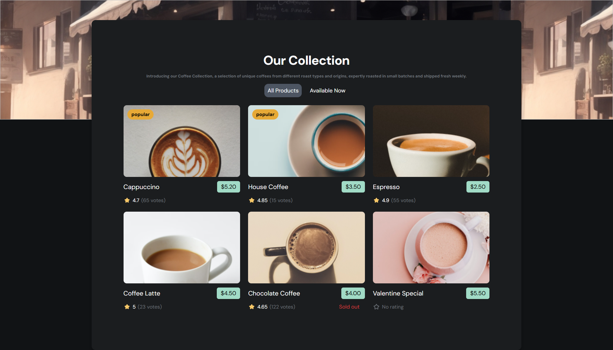

# ☕ Coffee Listing

یک پروژه ساده و جذاب برای نمایش لیستی از نوشیدنی‌های قهوه با استفاده از HTML، CSS و JavaScript. این پروژه بخشی از تمرینات طراحی رابط کاربری و مهارت‌های DOM manipulation می‌باشد.

---

## 🖼️ پیش‌نمایش

 

---

## 📦 ویژگی‌ها

- ✅ طراحی واکنش‌گرا (Responsive)
- 🎨 رابط کاربری جذاب و مدرن
- 🧭 قابلیت مرتب‌سازی و فیلترکردن نوشیدنی‌ها (در صورت پیاده‌سازی)
- 💡 ساختار HTML/CSS تمیز و قابل فهم
- ✔ استفاده از React

---

## 🚀 مشاهده دمو

[مشاهده دمو در GitHub Pages](https://yektaakhavan.github.io/coffee-listing/)

---

## 🛠️ تکنولوژی‌های استفاده شده

- HTML5
- CSS3
- JavaScript
- React

---

## 👤 توسعه‌دهنده
💻 ساخته شده توسط Yekta Akhavan

---
## 🙏 تشکر
اگر این پروژه برایتان مفید بود، با دادن ⭐ در GitHub از من حمایت کنید.

